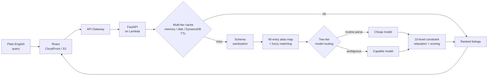

<picture>
  <source media="(prefers-color-scheme: dark)" srcset="https://raw.githubusercontent.com/jiacheng-fu/jiacheng-fu/main/assets/header.svg" />
  
</picture>

<picture>
  <source media="(prefers-color-scheme: dark)" srcset="https://raw.githubusercontent.com/jiacheng-fu/jiacheng-fu/main/assets/sec-about.svg" />
  
</picture>

CS student at **Texas A&M** in Austin, TX — B.S. December 2027 (3.87 GPA, math minor). I build and ship full-stack products end to end, work on **application security** for a production multi-tenant SaaS platform, and spent a summer writing an **LLVM compiler backend** for a vector DSP.

**Live:** [brianfu.vercel.app](https://brianfu.vercel.app) · [Axle](https://d1j3m9qdbgs5ik.cloudfront.net)

```console
$ security --summary
  50+ production vulnerabilities remediated   access-control, injection, race conditions
  13-stage pre-push verification pipeline     negative RLS probes, regression suites
  cross-tenant authorization gap closed       proven by reverse-reproduction
```

<picture>
  <source media="(prefers-color-scheme: dark)" srcset="https://raw.githubusercontent.com/jiacheng-fu/jiacheng-fu/main/assets/sec-stack.svg" />
  
</picture>

<picture>
  <source media="(prefers-color-scheme: dark)" srcset="https://raw.githubusercontent.com/jiacheng-fu/jiacheng-fu/main/assets/stack.svg" />
  
</picture>

<picture>
  <source media="(prefers-color-scheme: dark)" srcset="https://raw.githubusercontent.com/jiacheng-fu/jiacheng-fu/main/assets/sec-projects.svg" />
  
</picture>

|  | project | what it is |
|---|---|---|
| `▸` | **[Axle](https://github.com/jiacheng-fu/axle)** — [live ↗](https://d1j3m9qdbgs5ik.cloudfront.net) | AI-powered used-car search — plain English in, ranked real listings out. LLM pipeline with schema sanitization, fuzzy alias matching, two-tier model routing. Deployed serverless: FastAPI on Lambda behind API Gateway, React on CloudFront/S3, DynamoDB cache with native TTL holding it inside a 1,000-call/month budget.<br/><sub>`React` `FastAPI` `AWS Lambda` `DynamoDB` `API Gateway` `PostgreSQL`</sub> |
| `▸` | **[personal-website](https://github.com/jiacheng-fu/personal-website)** — [live ↗](https://brianfu.vercel.app) | Generative portfolio — a hand-written WebGL fragment shader (domain-warped fBm) that warps toward your cursor, with spring-driven scroll-linked reveals.<br/><sub>`TypeScript` `React` `WebGL` `GLSL`</sub> |
| `▸` | **[project-horizon](https://github.com/jiacheng-fu/project-horizon)** | Narrative exploration game, solo since 2023 — dialogue engine with typewriter text synced to voiceover audio and branching choices that gate progression.<br/><sub>`C#` `Unity`</sub> |
| `▸` | **[CarStatus](https://github.com/jiacheng-fu/CarStatus)** | CLI that pulls a BMW's live odometer, fuel/battery, and location via the Smartcar API.<br/><sub>`Node.js` `REST`</sub> |
| `▸` | **[wild-west-party-game](https://github.com/jiacheng-fu/wild-west-party-game)** | Live-multiplayer party game built in 24h at HowdyHack 2024 — I built the frontend.<br/><sub>`TypeScript` `Next.js`</sub> |

<picture>
  <source media="(prefers-color-scheme: dark)" srcset="https://raw.githubusercontent.com/jiacheng-fu/jiacheng-fu/main/assets/sec-architecture.svg" />
  
</picture>

How **Axle** turns a plain-English question into ranked listings — and stays inside a 1,000-call/month model budget.



Two things hold the budget: repeat questions never reach a model, and only genuinely ambiguous ones reach the expensive one. The relaxation ladder is why a query with no exact match still returns ranked results instead of an empty page.

<picture>
  <source media="(prefers-color-scheme: dark)" srcset="https://raw.githubusercontent.com/jiacheng-fu/jiacheng-fu/main/assets/sec-activity.svg" />
  
</picture>

<picture>
  <source media="(prefers-color-scheme: dark)" srcset="https://raw.githubusercontent.com/jiacheng-fu/jiacheng-fu/output/github-snake-dark.svg?v=6" />
  
</picture>

<picture>
  <source media="(prefers-color-scheme: dark)" srcset="https://raw.githubusercontent.com/jiacheng-fu/jiacheng-fu/main/assets/sec-contact.svg" />
  
</picture>

<table><tr>
<td><a href="https://linkedin.com/in/jiachengfu"><picture><source media="(prefers-color-scheme: dark)" srcset="https://img.shields.io/badge/LINKEDIN-0b0f14?style=for-the-badge&logo=linkedin&logoColor=00b8ff&labelColor=0b0f14" /></picture></a></td>
<td><a href="mailto:brian.fu123321@gmail.com"><picture><source media="(prefers-color-scheme: dark)" srcset="https://img.shields.io/badge/EMAIL-0b0f14?style=for-the-badge&logo=maildotru&logoColor=ff7b72&labelColor=0b0f14" /></picture></a></td>
<td><a href="https://github.com/jiacheng-fu"><picture><source media="(prefers-color-scheme: dark)" srcset="https://img.shields.io/badge/GITHUB-0b0f14?style=for-the-badge&logo=github&logoColor=00ff9f&labelColor=0b0f14" /></picture></a></td>
</tr></table>

<picture>
  <source media="(prefers-color-scheme: dark)" srcset="https://raw.githubusercontent.com/jiacheng-fu/jiacheng-fu/main/assets/footer.svg" />
  
</picture>
